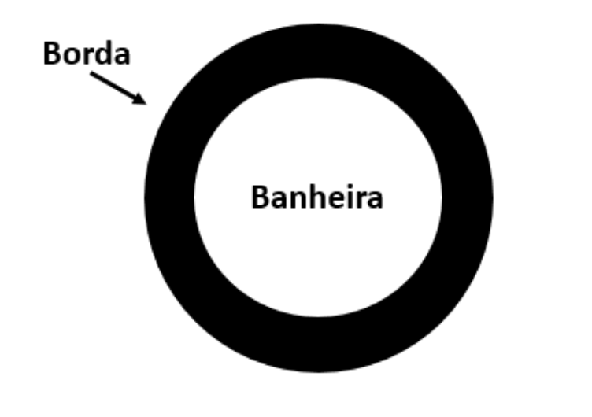

<table>
    <tr>
        <td>
            
        </td>
        <td>
IFPE – Instituto Federal de Pernambuco | Campus Paulista 
Curso: Análise e Desenvolvimento de Sistemas 
Professor: Fabrício Cabral <fabricio.cabral@ead.ifpe.edu.br> 
Disciplina: Introdução à Programação 
Atividade: Lista de Exercícios nº 03
        </td>
    </tr>
</table>

# Lista de Exercícios 03 – Introdução ao JavaScript

## Objetivo

O objetivo desta lista de exercícios é exercitar o estudante na linguagem de programação JavaScript.

## Exercícios

1. [BordaBanheira] Carlos é especialista em fabricar bordas de granito para banheiras de formato circular (conforme a figura abaixo). Sabendo que a borda é feita em uma peça única e o seu preço é calculado de acordo com a área (em m2) desta borda desenvolva um programa que solicite as medidas necessárias e o preço do m2 cobrado e calcule o preço total da peça.

    

2. [ConcessionariaMotos] Uma concessionária de motos revende uma moto acrescidos 26% referidos a impostos, 2% referente ao seguro, 8% do lucro da revendedora e 1% da comissão do vendedor. Sabendo-se que estas porcentagens são calculadas com relação ao preço de fábrica (preço que a revendedora compra a moto), desenvolva um programa que calcule o preço de venda desta moto na concessionária.

3. [MediaRelativa] Sabendo que em uma determinada disciplina houve apenas duas provas e que o professora já sabe a média da turma, desenvolva um programa na linguagem JavaScript que determine o percentual da média deste aluno com relação à média da turma. **Sugestão:** lembre-se que 1⁄3 de uma barra de chocolate equivale a (aproximadamente) 33% do total desta barra.

4. [PintarTampas] Na cidade de Iati-PE existe uma empresa que fabrica tonéis cilíndricos de aço que são utilizados para armazenar água. Cada tonel produzido possui uma tampa lisa feita do mesmo material do tonel. Sabendo que a empresa gasta R$ 2,50 para pintar um m2 desta tampa com um tipo especial de tinta, desenvolva um programa que solicite as medidas desta tampa e a quantidade de tampas a serem pintadas e informe ao usuário quanto a empresa irá gastar para pintá-las.
   
5. [Eleicao] Desenvolva um programa que solicite que um usuário informe o número de votos brancos, nulos e válidos de uma eleição e exiba o percentual que cada um representa em relação ao total de eleitores.

6. [CalcularSalario] Em uma determina empresa, um vendedor ganha um salário-base. Sobre este salário-base há um desconto de 9% referente a impostos e o mesmo ganha ainda uma comissão de R$ 20,00 por cada produto vendido. Além disso, um vendedor pode pedir um adiantamento (vale), que deverá ser descontado no valor final do seu salário. Com base nestas informações, desenvolva um programa que calcule quanto um vendedor desta empresa ganhará no final do mês.
   
7. [CustoViagem] Desenvolva um programa que calcule os gastos com combustível em uma viagem. O programa deve solicitar ao usuário a distância a ser percorrida em km, o consumo do carro em km/litro e o preço do litro do combustível. Como resposta o programa deverá informar qual o valor em R$ a ser gasto com combustível na viagem.

8. [BandeirasJapao] Uma fábrica especializada na confecção de bandeiras recebeu uma encomenda para fabricar bandeiras do Japão. Para fabricar esta bandeira ela corta um retângulo branco e um círculo vermelho cujo tamanho deverá ser de um terço da área do retângulo branco. A seguir, ela costura o círculo vermelho no centro da bandeira branca. Assim, sabendo destas informações desenvolva um programa que solicite as medidas (em metros) de uma bandeira, o preço do m2 de cada tipo de tecido e a quantidade de bandeiras a serem fabricadas e retorne o custo total desta encomenda.

9. [Fertilizante] Para se produzir um determinado tipo de fertilizante, uma fábrica precisa misturar três partes de Nitrogênio (N), duas partes de Potássio (K) e uma parte de Fósforo (P). De posse dessa informação, desenvolva um programa que solicite como informação uma determinada quantidade (em Kg) deste fertilizante e informe ao usuário a quantidade (em Kg) necessária de Nitrogênio, Potássio e Fósforo para a mistura.

10. [Metroplaza] Na cidade de Garanhuns-PE há uma casa de shows chamada Metroplaza. Neste local há um bar que vende cerveja em lata durante os shows. O proprietário do estabelecimento sabe que para cada lata de cerveja vendida, 55% do preço refere-se ao custo de compra do produto, 25% refere-se a impostos e o restante do valor é o seu lucro. De posse dessa informação, desenvolva um programa que solicite o preço de venda (em reais) de uma lata de cerveja e a quantidade de latas vendidas durante um show e exiba para o usuário o total referente ao custo do produto (em reais), o total em impostos (em reais) e o total do lucro do proprietário (em reais). 
