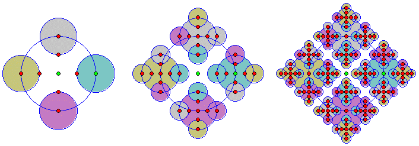
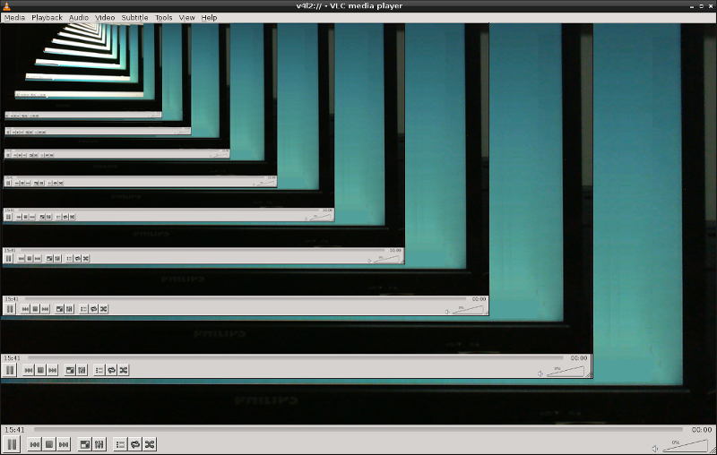

<style>
img[alt~="center"] {
    display: block;
    margin: 0 auto;
}
</style>

<!-- _paginate: false -->
# **Introdução à Programação**

## Capítulo 10 - Funções e Procedimentos

---

## Função

- Encapsula um código que poderá ser invocado/chamado por qualquer outro trecho do programa
- Vantagens
    - Resulta em códigos mais fáceis de serem entendidos
    - Simplifica o código, pois quebra um problema maior em outros menores
    - Reduz a incidência de erros de programação

---

## Função

- Sintaxe

```javascript
function nomeDaFunção(parametro1, parametro2, ..., parametroN) {
    // Código da função
    return resultado;
}
```

---

## Função

- Exemplo: calcular a média de 3 notas

```javascript
function media(nota1, nota2, nota3) {
    var soma = nota1 + nota2 + nota3;
    return soma / 3;
}

document.write(media(7.0, 8.0, 6.0));
```

---

## Função

- Exemplo: calcular a média de um conjunto notas (array)

```javascript
function media(notas) {
    var soma = 0;
    for (var i = 0; i < notas.length; i++) {
        soma = soma + notas[i];
    }
    return soma / notas.length;
}

var notas = [7.0, 8.0, 6.0];
document.write(media(notas));
```

---

## Função

- Exemplo: ler um número inteiro informado pelo usuário

```javascript
function leInteiro(msg) {
    var num;
    do {
        num = parseInt(prompt(msg));
    } while (isNaN(num));
    return num;
}

document.write(leInteiro("Informe sua idade"));
```

---

## Função

- Exemplo: calcular o fatorial de um número inteiro

```javascript
function fatorial(numero) {
    var resultado = 1;
    for (var i = 1; i < numero; i++) {
        resultado = resultado * i;
    }
    return resultado;
}

document.write(fatorial(0) + "<br>");
document.write(fatorial(5) + "<br>");
```

---

## Procedimento

- Função que não retorna nenhum resultado
- Sintaxe

```javascript
function nomeDaFunção(parametro1, parametro2, ..., parametroN) {
    // Código da função **SEM** return
}
```

---

## Procedimento

- Exemplo: escreve uma mensagem na tela

```javascript
function escreve(msg) {
    document.write(msg);
    document.write("<br>");
}
```

---

## Função Recursiva




---

## Função Recursiva



---

## Função Recursiva

- Função que invoca ela mesma
- Apresenta o *mesmo* resultado de uma versão de função não recursiva
- Geralmente apresenta um código menor e mais simples de ser entendido
- Precisa preencher dois requisitos
    - Condição de parada
    - Chamar a si mesma no bloco de código dentro da função

---

## Função Recursiva

- Exemplo: calcular o fatorial de um número

```javascript
function fatorial(num) {
    if (num == 0) {
        return 1;
    }
    return num * fatorial(num - 1);
}

document.write(fatorial(0) + "<br>");
document.write(fatorial(5) + "<br>");
```

---

## Referências

L. O. Brandão, Material didático para Introdução à Programação,
https://www.ime.usp.br/~leo/mac2166/2017-1/introducao_funcoes.html, acessado em 30/11/2022.

