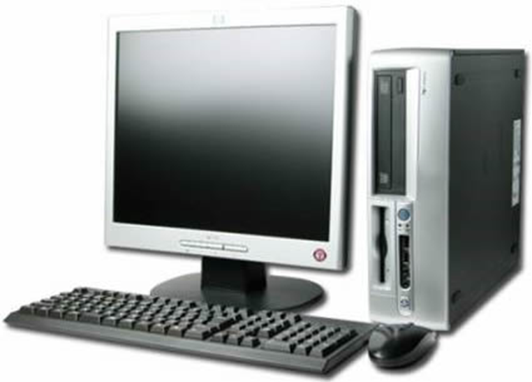
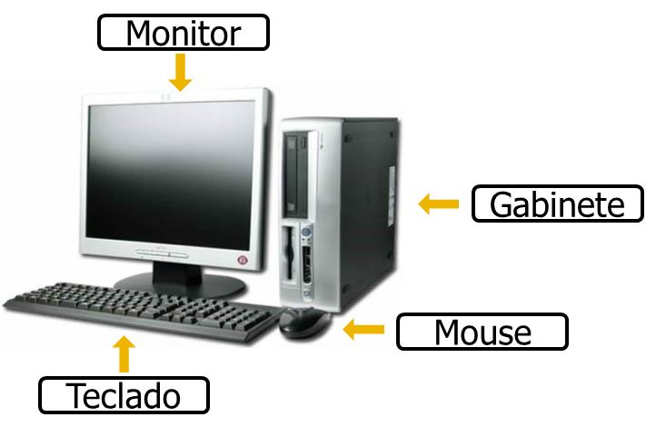
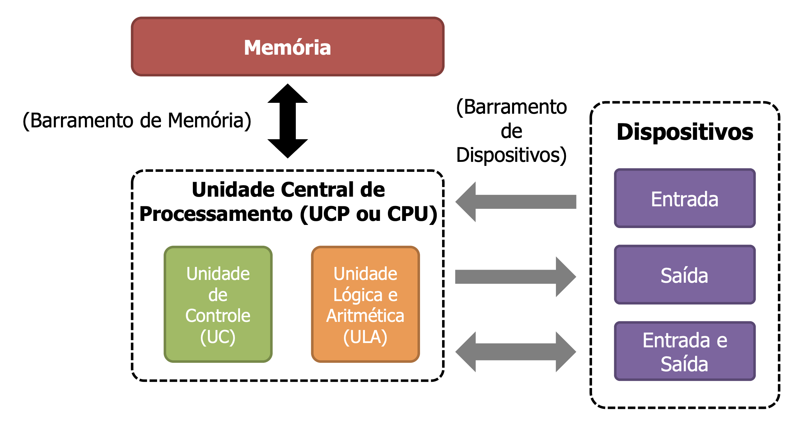
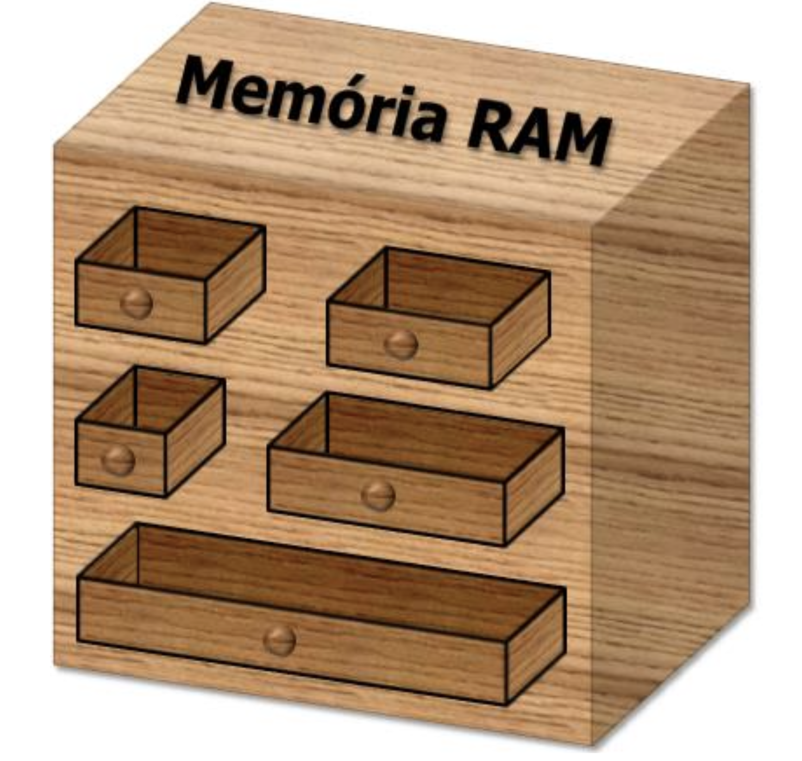
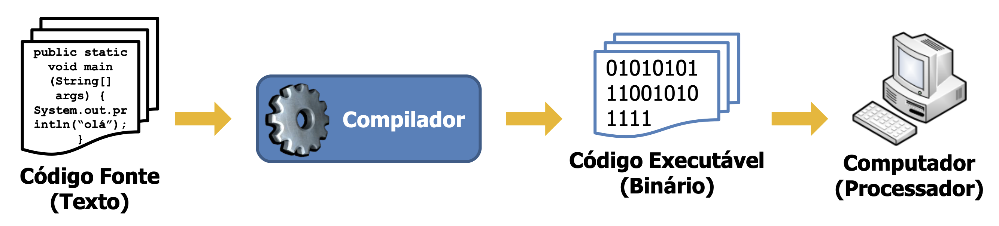
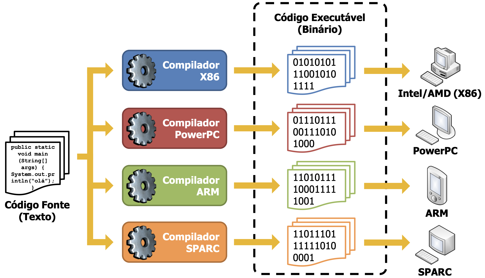

<!-- _paginate: false -->
# **Lógica de Programação**

## Capítulo 1 - Conceitos Básicos de Informática

---

## Introdução

- Você conhece esta máquina?

---

## Elementos Constituintes

- Um computador é constituído por diversos elementos
  - Hardware
    - Parte física do computador (dispositivos)
  - Software
    - Parte lógica do computador (software ou programas de computador)

---

## Elementos Constituintes

---

## O que é o Computador?

- O **computador** é uma máquina **programável**, capaz de receber, armazenar e processar **dados** e retornar o resultado do processamento destes dados
  - Receber dados por meio dos **dispositivos** de entrada ou entrada e saída
  - Processar estes dados seguindo instruções predeterminadas
  - Expressar uma resposta em um dispositivo de saída ou entrada e saída

---

## O que é o Computador?

- Ser **programável** é capacidade de mudar suas ações de acordo com a vontade do utilizador
  - As ações de um computador são governadas por meio de um elemento denominado **programa de computador** ou **software**

---

# Dispositivos

- Dispositivo
  - Peça útil ou máquina menor de um equipamento
  - Exemplos: teclado, mouse, monitor, etc.
- Utilizador
  - Entidade que manipula um dispositivo
  - Exemplos: uma pessoa, uma máquina ou software (programa de computador)

---

# Dispositivos

- Dispositivos de entrada de dados
  - São dispositivos que permitem a comunicação (envio dos dados) **apenas** no sentido do utilizador para o dispositivo
  - Exemplos: teclado, mouse, scanner, caneta ótica, microfone, leitor de código de barras, webcam, joystick, etc.

---

## Dispositivos

- Dispositivos de saída de dados
  - São dispositivos que permitem a comunicação (envio dos dados) **apenas** no sentido do dispositivo para o utilizador
  - Exemplos: monitor, impressora, placa de vídeo, caixas de som,
plotter, fax, etc.

---

## Dispositivos

- Dispositivos de entrada e saída dados
  - São dispositivos que permitem a comunicação (envio dos dados) **em ambos** os sentidos, isto é, do dispositivo para o utilizador e vice-versa
  - Exemplos: disco rígido, gravador de CD/DVD, pen drive, cartão de memória, monitor sensível ao toque (touchscreen), placa de rede, joystick vibratório, etc.

---

## Funcionamento de um Computador

- A anatomia de um microcomputador atual ainda obedece a **Arquitetura de Von Neumann**
  - Arquitetura são os componentes básicos, o que eles fazem e como eles se relacionam
  - John Von Neumann (pronuncia-se Djon von Nóiman) foi um matemático Húngaro-Americano que estabeleceu a arquitetura de um computador (e é usada até hoje)

---

## A Arquitetura de Von Neumann

---

## A Arquitetura de Von Neumann

- Unidade Central de Processamento (UCP ou CPU)
  - Responsável pelo processamento dos dados e programas
    - A ULA executa as instruções dos programas, como as instruções lógicas, aritméticas, desvios condicionais, etc.
    - A UC se encarrega de controlar as ações a serem realizadas pelo computador, comandando todos os outros componentes
  - Exemplos: Intel Core i3/i5/i7/i9, AMD Ryzen, Apple M1/M2, etc.

---

## A Arquitetura de Von Neumann

- Memória
  - Local onde os programas e dados a serem processados pela CPU são armazenados temporariamente
  - Exemplo: memória RAM (Random Access Memory)

---

## A Arquitetura de Von Neumann

- Barramento
  - Permite a interligação da CPU com a memória e outros dispositivos
  - Podem ser de vários tipos
    - Barramento de Processador
    - Barramento de Memória
    - Barramento de Entrada e Saída (Dispositivos)

---

## A Arquitetura de Von Neumann

- Dispositivos de entrada e saída
  - Permite o envio e recebimento dos dados para a CPU
  - Exemplo: Monitor, teclado, impressora, mouse, disco rígido, etc.

---

## A Unidade Central de Processamento (CPU)

- Executa tarefas de acordo com as instruções (ou comandos) pré-determinadas
  - As instruções dizem ao computador como manipular e processar dados
  - Cada arquitetura de processador possui um conjunto próprio de instruções
  - Exemplos: X86, ARM (maioria das CPU dos celulares), RISC-V, etc.

---

## Memória

- Por ser um equipamento elétrico, um computador codifica a informação a ser manipulada na forma de pulsos elétricos, denominados de bits
- Um **bit** (BInary digiT – dígito binário) é a menor unidade de informação que pode ser armazenada ou transmitida
  - Um bit só pode assumir dois valores: 0 ou 1, verdadeiro ou falso
  - Pode ser representado de diversas formas: eletricidade, luz, ondas eletromagnéticas ou polarização magnética

---

## Memória

- Um **byte** é um conjunto de 8 bits
- O tamanho da memória é medido em potências de 2

---

## Medindo o Tamanho da Memória

Nome     | Símbolo | Quantidade (em bytes)
---------|---------|----------------------------------
Byte     | B       | 1
Kibibyte | KiB     | 1.024
Mebibyte | MiB     | 1.048.576
Gibibyte | GiB     | 1.073.741.824
Tebibyte | TiB     | 1.099.511.627.776

---

## Medindo o Tamanho da Memória

Nome     | Símbolo | Quantidade (em bytes)
---------|---------|----------------------------------
Pebibyte | PiB     | 1.125.899.906.842.624
Exbibyte | EiB     | 1.152.921.504.606.846.976
Zebibyte | ZiB     | 1.180.591.620.717.411.303.424
Yobibyte | YiB     | 1.208.925.819.614.629.174.706.176

---

## Memória

- Memória Principal
- Memória Secundária

---

## Memória Principal

- Também conhecida como memória RAM (Random Access Memory)
- É um dispositivo dito volátil, isto é, perde os dados quanto a energia é desligada
- Armazena os bits (no qual os dados estão codificados) em unidades denominadas células de memória
- As células da memória principal são utilizadas em grupos que são identificados de maneira única por meio de um endereço
  - Por meio dos endereços é possível acessar um grupo de células de memória para ler ou modificar o seu conteúdo

---

## Memória Principal

---

## Memória Principal

- Vantagens
  - Baixa latência (muito rápida)
  - Latência é a medida do tempo de atraso em um sistema
- Desvantagens
  - Perde os dados quando a energia é desligada
  - Possui baixa capacidade de armazenamento de dados
  - Alto custo por MB

---

## Memória Secundária

- Dispositivo utilizado para a **persistência** dos dados
  - Persistência é o armazenamento dos dados em memória não- volátil
  - Um dispositivo de memória é dito não-volátil quando este não perde dos dados quando a energia é desligada
- Apresentam diferentes tecnologias
  - Magnética, ótica e eletrônica
- Exemplos
  - Hard Disk (Disco Rígido), CD, DVD, Pen drive, Fita

---

## Memória Secundária

- Vantagens
  - Não perde os dados quando a energia é desligada
  - Alta capacidade de armazenamento de dados
  - Baixo custo por MB
- Desvantagens
  - Alta latência (se comparado com a memória RAM)
  - Sensível a variações mecânicas ou térmicas

---

## Conceitos de Programação

- Um **programador** (ou desenvolvedor) é a pessoa que desenvolveu (ou escreveu) um programa de computador
- Um **programa de computador** ou **software** é composto de um conjunto de instruções que dizem ao computador como ele deve realizar uma determinada tarefa
  - Exemplos: Windows, Word, Excel, Internet Explorer, etc
- Uma **instrução** ou **comando** é uma símbolo, palavra, ou expressão que representa uma operação a ser executada pela CPU
  - Exemplos: + - * / % ; . {} [] () , if else document.write

---

## Conceitos de Programação

- As instruções contidas em um programa de computador são expressas em uma linguagem padronizada denominado de **linguagem de programação**
  - Exemplos: Java, C, Pascal, C++, Object Pascal, C#, Python
- Para poder utilizar uma linguagem de programação é preciso conhecer a sua **sintaxe**

---

## Conceitos de Programação

- A **sintaxe de uma linguagem de programação** é o conjunto de regras que constituem a linguagem de programação (palavras-chave, símbolos, etc.)
  - Exemplos: var, if, for, switch, “”, ;, (), +, *, /, etc.

---

## Conceitos de Programação

- Código Fonte
  - Programa de computador no formato texto escrito e entendível pelo programador em uma linguagem de programação
- Compilador
  - Programa de computador responsável pela transformação do código fonte em código executável
- Código Executável
  - Programa de computador codificada no formato binário a ser executado pela CPU do computador

---

## Conceitos de Programação

- **Compilação** é a transformação (ou tradução) do programa escrito pelo programador em programa executável pelo computador

---

## Compilação para cada Arquitetura (CPU)

